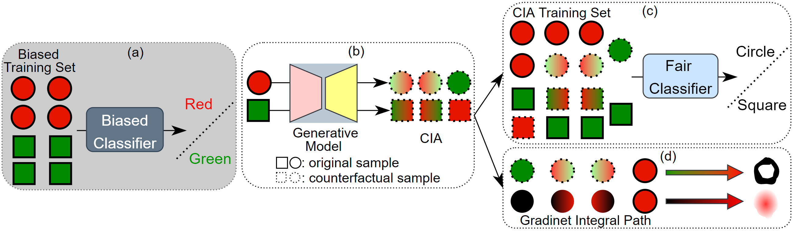

<div align='center'>
 
# [Counterfactual Interpolation Augmentation (CIA): A Unified Approach to Enhance Fairness and Explainability of DNN](https://qiangyao1988.github.io/assets/publications/2022_CIA/paper_CIA.pdf)

<table align="center">
  <tr>
    <td align="center"> 
       
      <br>
      <em style="font-size: 18px;">  <strong style="font-size: 18px;">Figure 1:</strong> An illustrative example.</em>
    </td>
  </tr>
</table>
</div>

Welcome to the official repository for the paper, [Counterfactual Interpolation Augmentation (CIA): A Unified Approach to Enhance Fairness and Explainability of DNN](https://qiangyao1988.github.io/assets/publications/2022_CIA/paper_CIA.pdf). This repository contains the code for the experiments used in the paper.

## Abstract
Bias in the training data can jeopardize fairness and explainability of deep neural network prediction on test data. We propose a novel bias-tailored data augmentation approach, Counterfactual Interpolation Augmentation (CIA), attempting to debias the training data by d-separating the spurious correlation between the target variable and the sensitive attribute. CIA generates counterfactual interpolations along a path simulating the distribution transitions between the input and its counterfactual
example. CIA as a pre-processing approach enjoys two advantages: First, it couples with either plain training or debiasing training to markedly increase fairness over the sensitive attribute. Second, it enhances the explainability of deep neural networks by generating attribution maps via integrating counterfactual gradients. We demonstrate the superior performance of the CIA-trained deep neural network models using qualitative and quantitative experimental results.

## Code structure
The code is structured as follows:
```
-- Run vanilla classifier
    -- BiasedMNIST Classification.py
    -- CelebA Heavymakeup Classifer.py
-- Run CVAE to generate counterfactual examples
    -- BiasedMNIST CAVE.py
    -- CelebA Pretrain CVAE.py
-- Run classifer with augmented datasets
    -- CelebA Heavymakeup Aug Training.py
-- Run CGI and baseline attribution methods
    -- BiasedMNIST Attribution.py
    -- CelebA Heavymakeup Attribution.py
```

## 4) Cite This Work
```
@inproceedings{qiang2022counterfactual,
  title={Counterfactual Interpolation Augmentation (CIA): A Unified Approach to Enhance Fairness and Explainability of DNN.},
  author={Qiang, Yao and Li, Chengyin and Brocanelli, Marco and Zhu, Dongxiao},
  booktitle={IJCAI},
  pages={732--739},
  year={2022}
}
```
